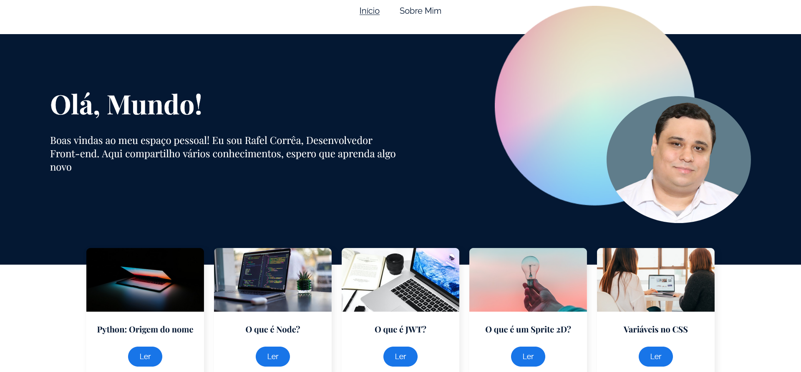

<h4 align="center"> 
	
</h4>
<p align="center">
 <a href="#-sobre-o-projeto">Sobre</a> •
 <a href="#-funcionalidades">Funcionalidades</a> •
 <a href="#-layout">Layout</a> •
 <a href="#-tecnologias">Tecnologias</a> •
 <a href="#-autor">Autor</a> • 
 <a href="#user-content--licença">Licença</a>
</p>

<h1 align="center">
    
</h1>

## 💻 Sobre o projeto

🚀 Olá mundo! é um blog pessoal para minha apresentação como desenvolvedor front-end especializado em React. Além disso o blog traz informações sobre diversas outras áreas e linguagens dentro da programação.

---

## ⚙️ Funcionalidades

- [x] Exibe diversos posts sobre as lingaguens de programação;
- [x] Possui uma apresentação sobre mim contando um pouco sobre meu inicio nessa área de tecnologia;
- [x] Possibilidade de navegação entre as paginas utilizando o react-router-dom;


## 🎨 Layout

O layout da aplicação está disponível no Figma:

<a href="https://www.figma.com/file/nDTrIQxTu6aldQG0o0iAbj/Ol%C3%A1%2C-Mundo!---Projeto-React%3A-router?type=design&node-id=38-716&t=aDBzafcIo25HiorD-0">
  
</a>

## 📝 Aprendizados

Foi utilizado uma SPA (Single Page Application), foi construída com a biblioteca React Router DOM, temos no projeto diversas páginas, diversas rotas. foi utilizado recurso de Rotas Aninhadas onde utilizamos um mesmo recurso em diferentes rotas. Foi criado a página não encontrada.

Também foi criado diversos posts onde também conseguimos ver um recurso de rotas dinâmicas utilizando por exemplo hook use params. Falando em hook, também foi utilizado o hook use location, usei ele para estilizar os links de início dependendo da rotas que estava, pois precisava da informação dessa rota.

Utilizei também use location em um desafio. No card de qualquer artigo, se for até o final vocês verão estes cards de posts recomendados. Também foi utilizado para sempre retornar ao topo da página, com o componente do react router dom chamado scroll to top.

#### 🧭 Rodando a aplicação web (Modo desenvolvimento)

```bash
# Clone este repositório
$ git clone https://github.com/alura-cursos/ola-mundo/tree/aula-5
# Acesse a pasta do projeto no seu terminal/cmd
$ cd  ola-mundo
# Instale as dependências
$ npm install
# Execute a aplicação em modo de desenvolvimento
$ npm run start
# A aplicação será aberta na porta:3000 - acesse http://localhost:3000
```
---

## 🛠 Tecnologias

As seguintes ferramentas foram usadas na construção do projeto:

#### **Website**

- **[React](https://reactjs.org/)**
- **[React Router Dom](https://reactrouter.com/en/main)**
- **[Sass](https://sass-lang.com/)**

#### **Utilitários**

- Protótipo: **[Figma](https://www.figma.com/)** → **[Protótipo (Olá Mundo)](https://www.figma.com/file/nDTrIQxTu6aldQG0o0iAbj/Ol%C3%A1%2C-Mundo!---Projeto-React%3A-router?type=design&node-id=38-716&t=aDBzafcIo25HiorD-0")**
- Editor: **[Visual Studio Code](https://code.visualstudio.com/)**
  - Extensão: **[S7 React/Redux/React-Native/JS snippets](https://marketplace.visualstudio.com/items?itemName=dsznajder.es7-react-js-snippets)**
- CSS Modules: **[CSS Modules](https://github.com/css-modules/css-modules)**
- Documentação do React: **[React Documentation](https://create-react-app.dev/docs/adding-a-stylesheet/)**

---

## 🦸 Autor

 <sub><b>Rafael Corrêa</b></sub></a> <a href="https://www.linkedin.com/in/correarafaelsantos/" title="Alura Space">🚀</a>
 <br />
👋🏽 [Entre em contato pelo Linkedin!](https://www.linkedin.com/in/correarafaelsantos/)

---